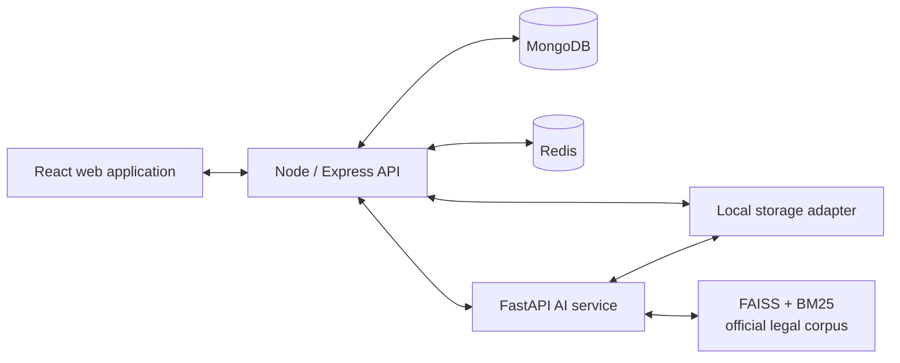
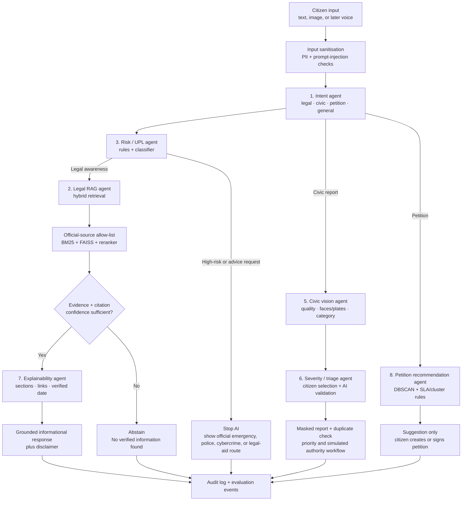

# CAP architecture and agent workflow

## Service boundary

## AI orchestrator workflow

## Guardrails

1. The **Risk / UPL agent runs before legal generation**.
2. The legal agent may generate only when official-source retrieval, reranking, and citation validation pass configured thresholds.
3. The system records source identifiers, sections/articles, source URLs, verification dates, confidence, and the policy decision behind every legal response.
4. The civic and petition agents make recommendations, never external government submissions or emergency calls.
5. The language pipeline is English-only in the first release; its service boundary keeps multilingual expansion isolated.

## Increment path

| Increment | Outcome |
| --- | --- |
| 1 | Foundation, public UI, auth/RBAC boundary, CI and operational documentation — **done** |
| 2 | Legal learning paths and official-source ingestion — **in progress**: ingestion pipeline, hybrid retrieval (BM25; dense embeddings optional), document browser, and 3 grounded learning articles are built and tested; BNS/BNSS full-corpus ingestion (FIR, bail, offences-against-property chapters) still outstanding |
| 3 | Grounded legal RAG, UPL/risk guardrails, evaluation harness |
| 4 | Civic reporting, image privacy processing, duplicates, SLA and Authority UI |
| 5 | Petitions, signatures, moderation and recommendation agent |
| 6 | Evaluation, observability and deployment preparation |

## Legal corpus ingestion (Increment 2)

```mermaid
flowchart LR
  Raw["data/legal-corpus/<source>/raw.txt\n(the upload folder)"] --> Clean["clean.py\nlayout-artifact removal only"]
  Clean --> Chunk["chunk.py\nsection/article boundary split"]
  Chunk --> Manifest["source.json + chunks.jsonl\nchecksum, as-on date, coverage note"]
  Manifest --> Index["index_build.py\nBM25 always; dense embeddings if installed"]
  Index --> Search["retrieval/search.py\ncited results, no generation"]
  Search --> API["FastAPI /corpus/*"]
  API --> Proxy["Node /api/corpus/*"]
  Proxy --> UI["Document browser + learning articles"]
```

Re-running `python services/ai/scripts/ingest_corpus.py` after editing or adding a `raw.txt` is the entire re-indexing workflow — no other code changes needed to pick up updated source text. This layer is retrieval-only by design: Module 1B (the conversational legal chat) adds LLM generation, citation validation, and abstention on top of the same index, and is intentionally not built yet.

