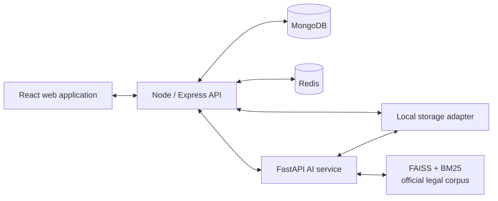
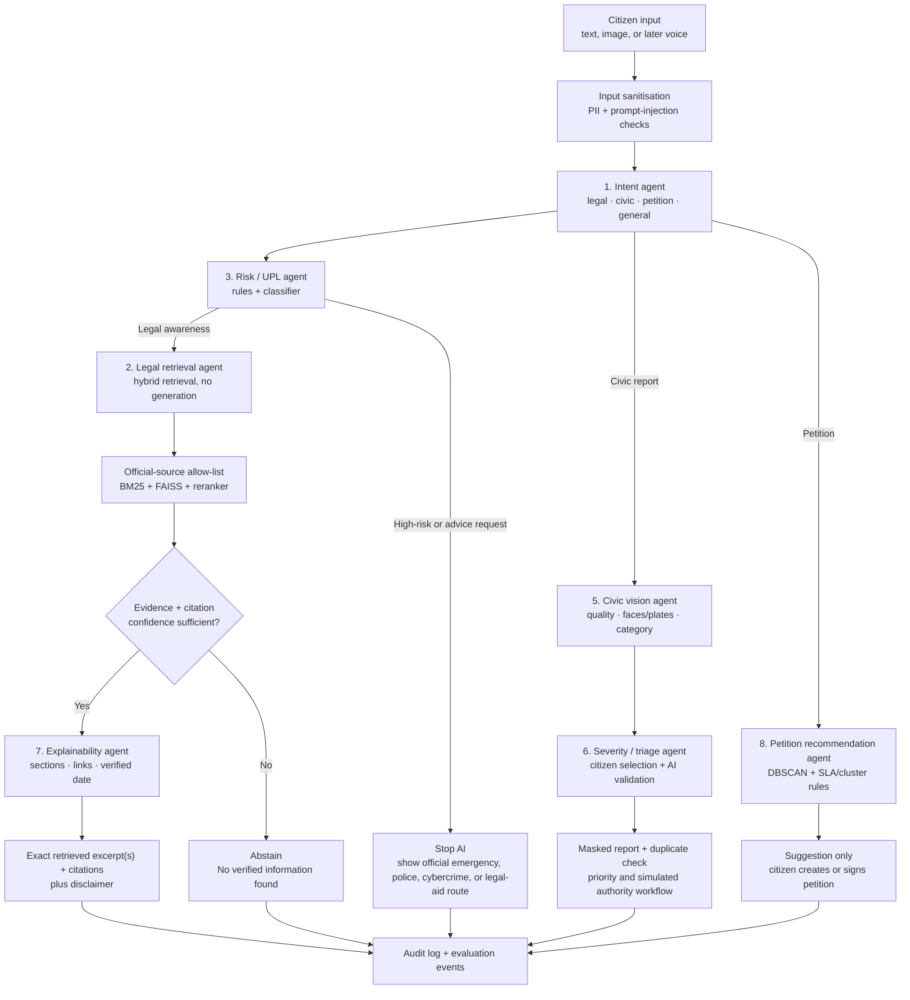
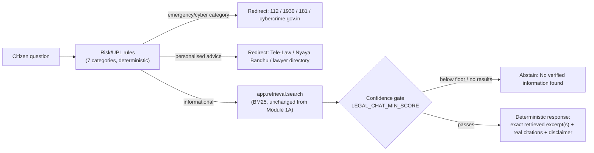

# CAP architecture and agent workflow

## Service boundary

## AI orchestrator workflow

## Guardrails

1. The **Risk / UPL agent runs before legal retrieval**.
2. **The legal-answer path never uses a generative LLM** (standing decision — hallucination risk in a legal-information context is unacceptable; see `docs/PROJECT_STATE.md`). The legal agent returns a response only when official-source retrieval and its confidence gate pass configured thresholds; the response is always the verbatim retrieved text, never a generated or paraphrased claim.
3. The system records source identifiers, sections/articles, source URLs, verification dates, confidence, and the policy decision behind every legal response.
4. The civic and petition agents make recommendations, never external government submissions or emergency calls.
5. The language pipeline is English-only in the first release; its service boundary keeps multilingual expansion isolated.

## Increment path

| Increment | Outcome |
| --- | --- |
| 1 | Foundation, public UI, auth/RBAC boundary, CI and operational documentation — **done** |
| 2 | Legal learning paths and official-source ingestion — **in progress**: ingestion pipeline, hybrid retrieval (BM25; dense embeddings optional), document browser, and 3 grounded learning articles are built and tested; BNS/BNSS full-corpus ingestion (FIR, bail, offences-against-property chapters) still outstanding |
| 3 | Deterministic legal answers, UPL/risk guardrails, evaluation harness — **mostly done**: `POST /legal/answer` / `POST /api/legal/answer` implements Risk/UPL → retrieval → confidence gate → deterministic structured response (exact retrieved excerpts + citations, no generative LLM anywhere in the path — see "No-generation principle" below); a formal retrieval evaluation harness (Recall@K, MRR, nDCG, abstention accuracy, etc.) is still outstanding |
| 4 | Civic reporting, image privacy processing, duplicates, SLA and Authority UI |
| 5 | Petitions, signatures, moderation and recommendation agent |
| 6 | Evaluation, observability and deployment preparation |

## Legal corpus ingestion (Increment 2)

```mermaid
flowchart LR
  Raw["data/legal-corpus/<source>/raw.txt\n(the upload folder)"] --> Clean["clean.py\nlayout-artifact removal only"]
  Clean --> Chunk["chunk.py\nsection/article boundary split"]
  Chunk --> Manifest["source.json + chunks.jsonl\nchecksum, as-on date, coverage note"]
  Manifest --> Index["index_build.py\nBM25 always; dense embeddings if installed"]
  Index --> Search["retrieval/search.py\ncited results, no generation"]
  Search --> API["FastAPI /corpus/*"]
  API --> Proxy["Node /api/corpus/*"]
  Proxy --> UI["Document browser + learning articles"]
```

Re-running `python services/ai/scripts/ingest_corpus.py` after editing or adding a `raw.txt` is the entire re-indexing workflow — no other code changes needed to pick up updated source text. This layer stays retrieval-only by design (`app/retrieval/search.py`); Module 1B, described next, is layered strictly on top of it and never adds generation into that file, or anywhere else.

## Deterministic legal answers (Module 1B)

**Standing decision: no generative LLM in the legal-answer path.** An earlier direction prototyped an LLM-generation pipeline (provider abstraction, a real Gemini integration, citation/index validation on generated text) behind these same Risk/UPL checks. It was deliberately abandoned once weighed against hallucination risk in a legal-information context — see `docs/PROJECT_STATE.md`. The final design instead returns the verbatim retrieved text directly; there is no free-text output to validate against reality because nothing invents one.

Multiple or differing sources are never merged into one synthesized paragraph -- each retrieved chunk is returned as its own excerpt with its own citation, so conflicting or overlapping evidence is preserved by construction rather than needing separate reconciliation logic.

`POST /legal/answer` (AI service) and its proxy `POST /api/legal/answer` (Node) implement this end to end. The endpoint is intentionally public (no login) for v1, so every response — including redirects and abstentions — carries the current disclaimer text/version. No retrieval call happens for a message Risk/UPL catches. See `services/ai/app/generation/pipeline.py` (`handle_legal_query`, `build_legal_answer`) for the exact call order and `services/ai/app/safety/` for the rule sets.

