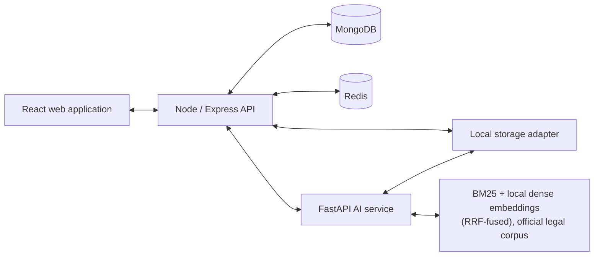
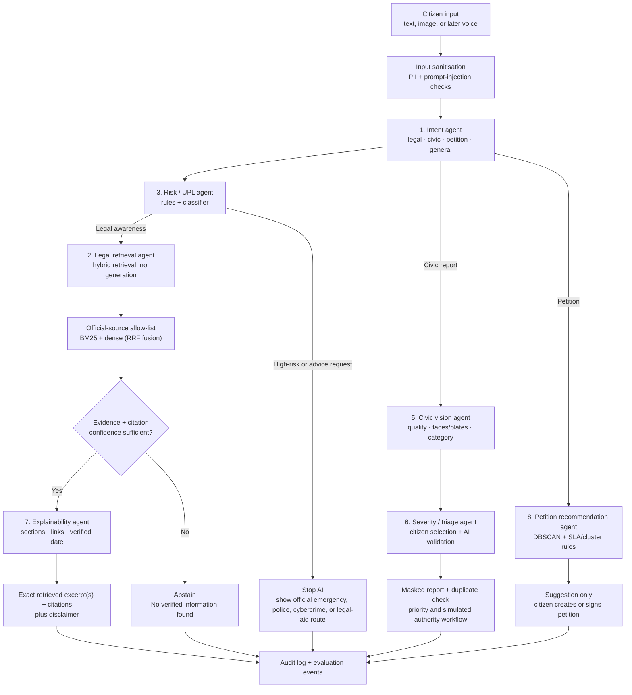
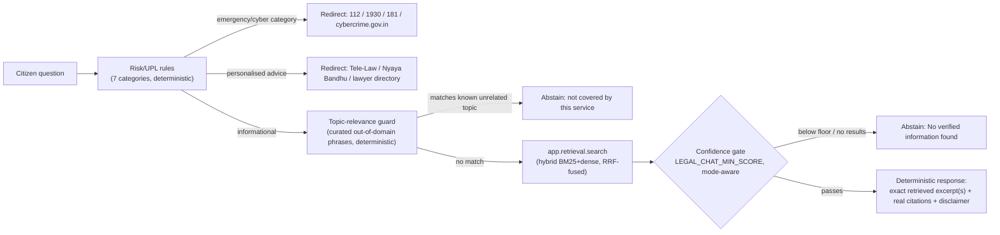
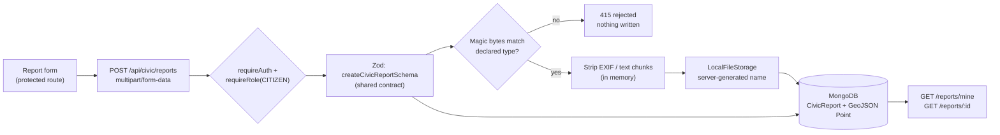
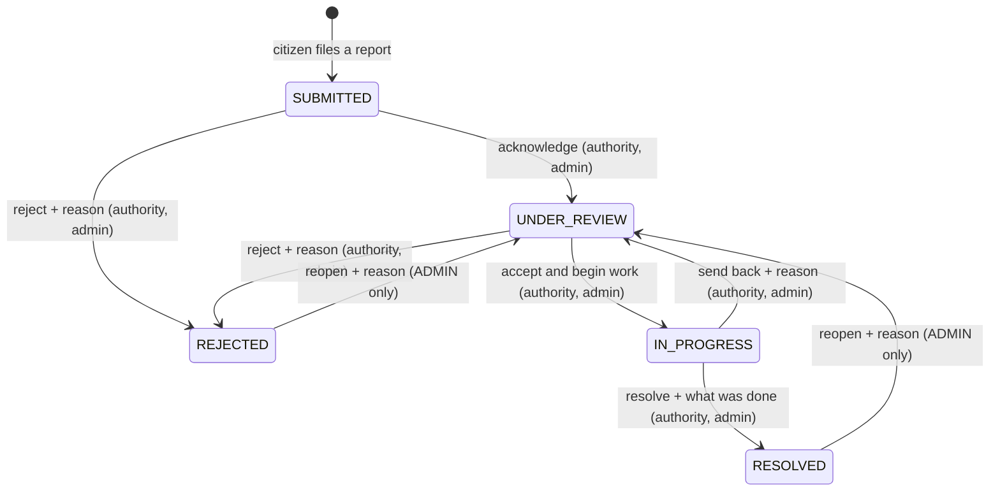

# CAP architecture and agent workflow

## Service boundary



## AI orchestrator workflow



## Guardrails

1. The **Risk / UPL agent runs before legal retrieval**, followed by a deterministic topic-relevance guard (also before retrieval) that abstains on queries matching a curated set of known out-of-domain subjects rather than letting an off-topic query reach the confidence gate at all — see the "Legal-answer pipeline" diagram below.
2. **The legal-answer path never uses a generative LLM** (standing decision — hallucination risk in a legal-information context is unacceptable; see `docs/PROJECT_STATE.md`). The legal agent returns a response only when official-source retrieval and its confidence gate pass configured thresholds; the response is always the verbatim retrieved text, never a generated or paraphrased claim.
3. The system records source identifiers, sections/articles, source URLs, verification dates, confidence, and the policy decision behind every legal response.
4. The civic and petition agents make recommendations, never external government submissions or emergency calls.
5. The language pipeline is English-only in the first release; its service boundary keeps multilingual expansion isolated.

## Increment path

| Increment | Outcome |
| --- | --- |
| 1 | Foundation, public UI, auth/RBAC boundary, CI and operational documentation — **done** |
| 2 | Legal learning paths and official-source ingestion — **in progress**: ingestion pipeline (raw.txt or raw.pdf, including a coordinate-based extractor for two-column India Code gazette PDFs — see `docs/LEGAL_SOURCES.md`), hybrid retrieval (BM25 + local dense embeddings, RRF-fused, evaluated against a BM25 baseline — see `docs/RETRIEVAL_EVALUATION.md`), document browser, and 3 grounded learning articles are built and tested; BNS/BNSS/BSA are now fully ingested (FIR, bail, and offences-against-property chapters included) but FIR-vs-NCR and bail-procedure learning articles are not yet written |
| 3 | Deterministic legal answers, UPL/risk guardrails, evaluation harness — **done**: `POST /legal/answer` / `POST /api/legal/answer` implements Risk/UPL → hybrid retrieval → confidence gate → deterministic structured response (exact retrieved excerpts + citations, no generative LLM anywhere in the path — see "No-generation principle" below); the retrieval evaluation harness (`services/ai/eval/`, Recall@K, Precision@K, MRR, nDCG, top-1 citation correctness, abstention accuracy) is built and was used to choose hybrid over BM25-only, and to tune its fusion/gate parameters, with real measured results. The browser-facing half landed in the M1 usability milestone: `/legal-assistant` renders this endpoint's response verbatim, and the auth/email-verification frontend integration shipped alongside it (see "Authentication and account activation" below) |
| 4 | Civic reporting, image privacy processing, duplicates, SLA and Authority UI — **citizen core done** (M2): report creation with optional photo, ownership-scoped retrieval, metadata stripping and local media storage (see "Civic reporting" below); the authority workflow is now built too (M3): a declared transition table, server-controlled status history, staff-assigned priority with SLA deadlines, and an authority queue/detail UI. Duplicate detection, vision and notifications are not built |
| 5 | Petitions, signatures, moderation and recommendation agent |
| 6 | Evaluation, observability and deployment preparation |

## Legal corpus ingestion (Increment 2)

```mermaid
flowchart LR
  Raw["data/legal-corpus/<source>/raw.txt OR raw.pdf\n(the upload folder)"] --> Extract["extract.py\nPDF-only: deterministic text-layer extraction"]
  Extract --> Clean["clean.py\nlayout-artifact removal only"]
  Clean --> Chunk["chunk.py\nsection/article boundary split"]
  Chunk --> Manifest["source.json + chunks.jsonl\nchecksum, as-on date, coverage note"]
  Manifest --> Index["index_build.py\nBM25 always; dense embeddings if installed\n(title+text indexed, verbatim text still displayed)"]
  Index --> Search["retrieval/search.py\nBM25 + dense + RRF fusion,\ncited results, no generation"]
  Search --> API["FastAPI /corpus/*"]
  API --> Proxy["Node /api/corpus/*"]
  Proxy --> UI["Document browser + learning articles"]
```



Adding a new official document is: drop an approved `raw.txt` (or
`raw.pdf`, extracted automatically and cached to `raw.txt` on first
ingest) into `data/legal-corpus/<source_id>/`, register `source_id` once
in `app/ingestion/sources.py`'s `APPROVED_SOURCES` allow-list if it's a
brand-new source, then run `python services/ai/scripts/ingest_corpus.py`.
That command is the entire re-indexing workflow for both text and
index — no retrieval code changes needed to pick up updated or added
source text. This layer stays retrieval-only by design
(`app/retrieval/search.py`); Module 1B, described next, is layered
strictly on top of it and never adds generation into that file, or
anywhere else.

### Hybrid retrieval (BM25 + dense, RRF-fused)

`app/retrieval/search.py` supports three modes (`bm25` | `dense` |
`hybrid`, selectable per call or via `RETRIEVAL_MODE`; `hybrid` is the
default whenever a dense index exists). Dense embeddings
(`sentence-transformers/all-MiniLM-L6-v2`, 384-dim, local, no paid API
— see `app/retrieval/embeddings.py`) are built at ingest time into a
persistent, L2-normalized `data/index/dense_vectors.npy`; hybrid mode
combines BM25 and dense candidate rankings with weighted Reciprocal
Rank Fusion (`app/retrieval/fusion.py`) rather than concatenating
result lists. Every result keeps its raw `bm25_score`/`bm25_rank` and
`dense_score`/`dense_rank` alongside the fused `score`, so fusion
behavior stays inspectable. **This was evaluated, not assumed** — see
`docs/RETRIEVAL_EVALUATION.md` for the BM25-vs-dense-vs-hybrid
measurements, why the textbook RRF default (k=60) underperformed at
this corpus size, and why a reranker stage was deliberately deferred
rather than added.

## Deterministic legal answers (Module 1B)

**Standing decision: no generative LLM in the legal-answer path.** An earlier direction prototyped an LLM-generation pipeline (provider abstraction, a real Gemini integration, citation/index validation on generated text) behind these same Risk/UPL checks. It was deliberately abandoned once weighed against hallucination risk in a legal-information context — see `docs/PROJECT_STATE.md`. The final design instead returns the verbatim retrieved text directly; there is no free-text output to validate against reality because nothing invents one.



Multiple or differing sources are never merged into one synthesized paragraph -- each retrieved chunk is returned as its own excerpt with its own citation, so conflicting or overlapping evidence is preserved by construction rather than needing separate reconciliation logic.

**Topic-relevance guard (`app/safety/topic_relevance.py`):** runs after Risk/UPL and before retrieval, same placement and same deterministic-rules-only design. It exists because the confidence gate's bounded dense-score threshold cannot separate every out-of-domain query from a genuine low-confidence legal paraphrase — both can land in the same ~0.42-0.49 band on this corpus (see `docs/RETRIEVAL_EVALUATION.md`'s "Remaining limitations"). Rather than raising that single global threshold (which would cost genuine coverage), a small curated set of phrase patterns for well-known non-legal-information subjects (company/business registration, income tax, driving licence/vehicle registration, identity documents, everyday non-civic topics) is checked first; a match aborts before spending a retrieval call. Anything it doesn't recognize still falls through unchanged to the existing confidence gate — this guard is deliberately narrow (extend only when evaluation names a specific new gap, same rule as `app/retrieval/query_expand.py`'s abbreviation dict), not a general topic classifier.

`POST /legal/answer` (AI service) and its proxy `POST /api/legal/answer` (Node) implement this end to end. The endpoint is intentionally public (no login) for v1, so every response — including redirects and abstentions — carries the current disclaimer text/version. No retrieval call happens for a message Risk/UPL or the topic-relevance guard catches. See `services/ai/app/generation/pipeline.py` (`handle_legal_query`, `build_legal_answer`) for the exact call order and `services/ai/app/safety/` for the rule sets.

## Civic reporting (Module 2 — citizen core)



**No Python in this path.** The AI service exists for the legal-answer pipeline; civic reporting has no AI in this milestone (no classification, no priority prediction, no vision), so routing CRUD through it would add a hop and a failure mode for no benefit. The browser still talks only to Node.

**Ownership is derived, never declared.** `reporterId` comes from the verified JWT; it is not part of the input schema, so a client-supplied value is dropped rather than trusted. Status and priority are likewise server-set. A citizen requesting another citizen's report receives **404 rather than 403**, so the API does not disclose which report ids exist; AUTHORITY and ADMIN may read any report, since they must act on them in a later milestone.

**Media privacy.** A phone photo's EXIF block routinely carries GPS coordinates and device identity — information the citizen did not choose to publish by attaching a picture. `services/api/src/lib/image-sanitize.ts` therefore strips metadata *before* anything is persisted: the original bytes never reach disk. It walks the JPEG/PNG container (dropping APPn/COM segments and `tEXt`/`zTXt`/`iTXt`/`eXIf`/`tIME` chunks) without decoding or re-encoding pixels, and adds no image-processing dependency. Files are identified by magic bytes, not by the client's `Content-Type`, and the two must agree. Storage names are always server-generated; a client filename is only ever a sanitised decorative suffix, never a path. This is metadata removal only — **face and number-plate masking are a later milestone**, and this layer is not a substitute for them.

Media is not public: `GET /api/civic/reports/:id/media/:mediaId` applies the same ownership rule as the report, so the URL is not a capability. The web app fetches it with its bearer token (`components/AuthedImage.tsx`) rather than through a plain ``.

`location` is stored as GeoJSON `{ type: "Point", coordinates: [longitude, latitude] }` with a `2dsphere` index so proximity and clustering queries are possible later without a migration; the API and UI speak `latitude`/`longitude`, and the inversion is unpacked in exactly one place (`lib/civic-reports.ts`). No GIS infrastructure, map library or reverse geocoding was added.

## Civic authority workflow (Module 2 — second slice)

The report lifecycle is a declared table, not scattered conditionals. `packages/contracts/src/civic.ts` holds every legal move; the API enforces it and the web app renders its action buttons from the same data, so the two cannot disagree about what is possible.



**A citizen appears in no rule.** That is the point of putting authorisation in the table rather than only in middleware: a future route that forgets `requireRole` still cannot let a citizen move their own report, because `checkCivicTransition` will refuse every pair for that role. ADMIN reaches further than AUTHORITY — only it may reopen a closed report — but it travels the same table. There is no endpoint anywhere that assigns an arbitrary status.

Four transitions demand a written reason: both rejections, the resolution, the send-back and the reopen. "Rejected, no explanation" is the failure mode a civic complaint system is judged on, so the rule is structural rather than advisory.

### Status history

Every status and priority change appends an entry to the report:

```
{ type, from, to, actorId, actorRole, note?, at }
```

Entries are constructed in `services/api/src/services/civic-workflow.ts` from the authenticated actor and the server clock. **Nothing from a request body reaches an entry except the note** — a client that posts `actorId`, `at`, `from` or a whole `history` array has those fields ignored, which is asserted by test rather than assumed.

History is **embedded in the report document** rather than kept in its own collection. It is only ever read with its report, only ever written by the workflow service, and bounded in practice by the state machine's shape; embedding also keeps a report and its audit trail in one atomic document, which is what makes the conditional update below correct without a transaction. If cross-report auditing or unbounded volume arrives, promoting it is a contained change — one writer, one reader.

`actorId` is returned only to AUTHORITY/ADMIN viewers. A citizen sees which role acted and why, which explains the decision without disclosing which member of staff made it; the mapper defaults to the narrower view so a new caller leaks nothing unless it opts in.

### Concurrency

Two authorities opening the same report is ordinary, so the write is conditional on the status the decision was made against:

```
findOneAndUpdate({ _id, status: <status we validated> }, { $set…, $push: history })
```

If somebody else transitioned the report in between, the filter matches nothing and the API answers **409** rather than silently overwriting their work. Check-then-act is the one real race in this workflow and it is closed at the write, not by hoping.

### Priority and SLA

**Priority is assigned by staff, not inferred.** Automatic assignment was considered and rejected: the only signals available at submission are category, free text and coordinates, and this project has no evidence base for mapping any of them onto real-world urgency. A category table that silently called every "water" report HIGH would look objective while encoding a guess — and in a queue, that ordering decides what gets attention first. Staff assignment is transparent, reviewable, and recorded in the same history as status changes. A measured rule can replace it later without touching the SLA mechanics, because the deadline derives from priority rather than from whatever set it.

| Priority | SLA window | Deadline |
| --- | --- | --- |
| HIGH | 48 h | `createdAt + 48h` |
| MEDIUM | 120 h | `createdAt + 120h` |
| LOW | 240 h | `createdAt + 240h` |

These are simulation values for a capstone project, not a service-level commitment by any real authority.

`dueAt` is always re-derived from `createdAt`, never from "now", so re-prioritising a week-old report does not hand it a fresh window — the clock runs from when the citizen reported the problem. **Overdue means past the deadline and still open**: once a report is resolved or rejected the clock stops, so historical reports do not accumulate a forever-growing breach count. The helpers are pure and take `now` as a parameter, so tests pin them to fixed instants and no result depends on the machine's local timezone.

### Authority scope

This simulation has **one authority**. An AUTHORITY user sees every report in every category, because the project models a single civic body rather than a jurisdictional hierarchy. Wards, departments and escalation chains would mean inventing a government structure the project has never specified, so the queue is deliberately flat and the limitation is recorded rather than papered over.

### Endpoints

| Method | Path | Who |
| --- | --- | --- |
| `GET` | `/api/civic/authority/reports` | AUTHORITY, ADMIN |
| `POST` | `/api/civic/reports/:id/transitions` | AUTHORITY, ADMIN (table decides the specific move) |
| `PATCH` | `/api/civic/reports/:id/priority` | AUTHORITY, ADMIN (open reports only) |

The queue is declared before `/reports/:id` so "authority" is never parsed as a report id, and its filters are validated against a shared Zod contract so only known fields reach the database. A transition is modelled as *creating a transition* rather than PATCHing a status field, because that is what actually happens: an actor performs a reviewable act that appends to the report's history.

Authorisation is enforced twice on purpose — `requireRole` keeps citizens out of the route, and the transition table independently decides whether this actor's role may make this particular move. Neither check is trusted alone.

## Authentication and account activation

Bearer-JWT auth, unchanged in design since Increment 1: `POST /api/auth/login` issues a 15-minute access token, `requireAuth`/`requireRole` guard protected routes, and `GET /api/auth/me` returns the current user. There is no refresh token; a session ends when the access token expires.

**Email verification.** Accounts are created unverified and login refuses an unverified account. The challenge is a 32-byte random token whose SHA-256 hash alone is stored (24-hour expiry), consumed by `POST /api/auth/verify-email`, with `POST /api/auth/resend-verification` for a lost or expired one (that endpoint answers identically for unknown and known addresses, so it cannot enumerate accounts). This project has **no mail transport** — outside production the raw token is returned in the API response and the web app carries it to `/verify-email`; in production that field is never populated, and wiring a provider means mailing the token from those two handlers with no other change. See `services/api/src/lib/email-verification.ts`.

**Frontend.** `apps/web/src/auth/AuthContext.tsx` holds auth state, persists the token in `localStorage`, attaches it via an axios interceptor, and always re-derives the user from `/auth/me` rather than caching it. `components/ProtectedRoute.tsx` guards routes that need an account (`/account`) and deliberately does not guard `/legal-assistant` — basic legal information stays public, matching the endpoint's own design.

The browser calls the Node API only; the Node API is the sole caller of the Python AI service. The Legal Assistant page (`/legal-assistant`) is the frontend for `POST /api/legal/answer` and renders the backend's response verbatim — excerpt text, citation, official-source link, verified-as-on date, and the response's own disclaimer — with no client-side summarising, paraphrasing or merging, so the no-generation guarantee is preserved end to end.

