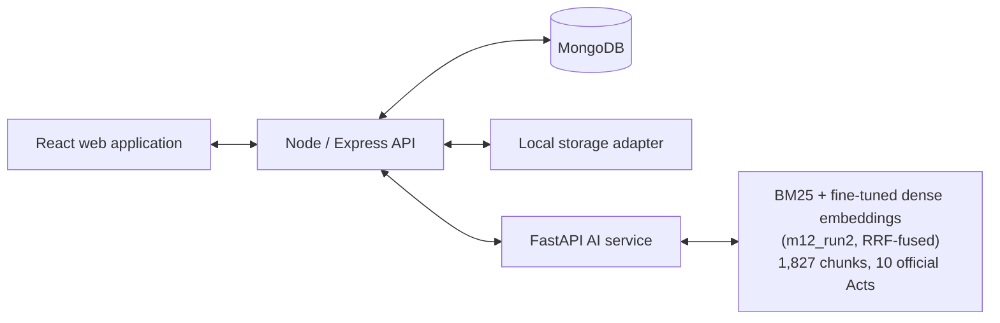
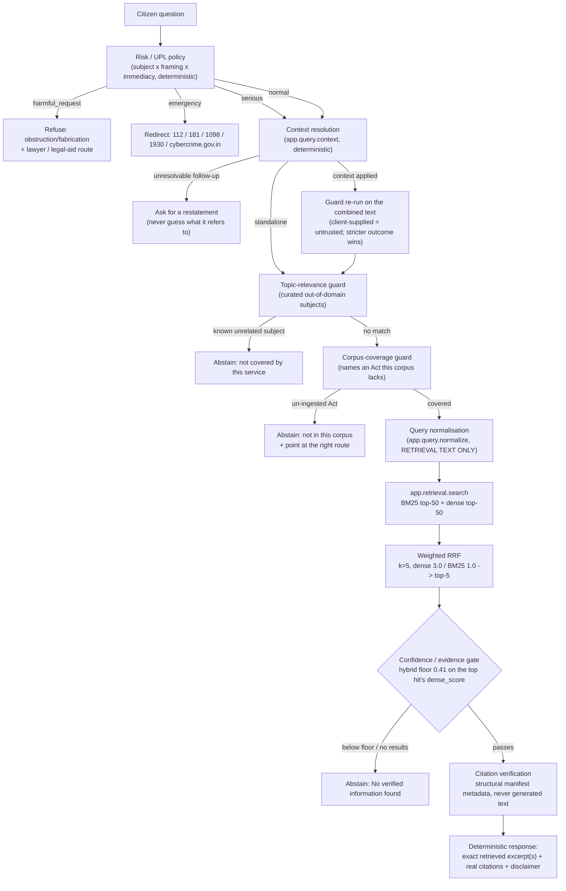
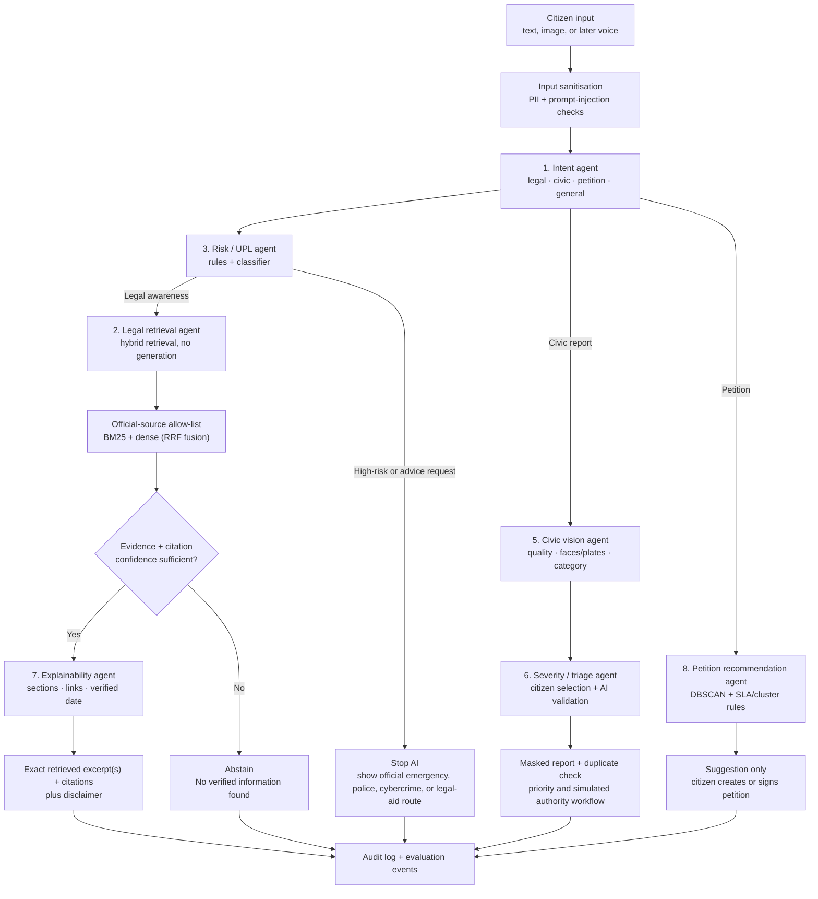
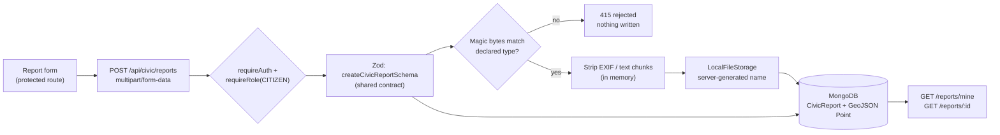
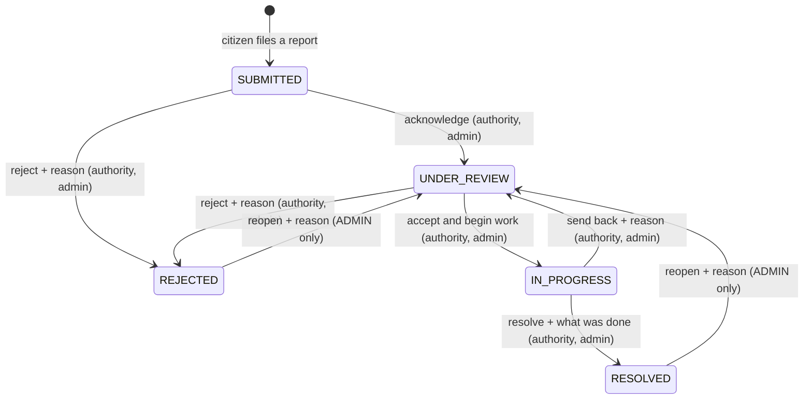

# CAT architecture

> **Status: final.** This document describes the frozen system at commit
> `c24eda2`. Sections explicitly labelled *historical* or *original plan*
> describe intentions or earlier states and are kept for the record;
> everything else is current.

## Service boundary



The browser never reaches the AI service directly. Every legal call is
`web -> POST /api/legal/answer (Node) -> POST /legal/answer (FastAPI)`,
so the AI boundary stays replaceable and unauthenticated legal traffic
still passes the API's rate limiting, structured logging and disclaimer
handling.

**Redis** runs as a Compose service and `REDIS_URL` is validated at boot,
but no application code connects to it: rate limiting uses
`express-rate-limit`'s in-process store, which is correct for the single
API instance this project deploys. It is drawn out of the diagram above
deliberately, so the diagram does not imply a dependency that does not
exist. A **Socket.IO** server is mounted on the HTTP server and emits a
`system:ready` handshake; no product feature uses real-time updates.

## The legal-answer pipeline (final)

This is the pipeline `app.generation.pipeline.handle_legal_query`
implements, in the exact order it runs. `POST /legal/answer` and its Node
proxy `POST /api/legal/answer` wrap this function and nothing else.



Insufficient evidence always resolves to one of three honest outcomes --
**ABSTAIN**, **CLARIFY** or **ROUTE** -- never to a filled gap.

### 0% GENERATIVE LLM IN THE LEGAL-ANSWER PIPELINE

**No generative LLM runs anywhere in this pipeline. Not as a generator,
not as a reranker, not as a fallback, not as a classifier. This is a
standing project decision, not a temporary state, and it is final.**

An LLM-generation direction was fully implemented early in the project --
provider abstraction, a real Gemini integration verified against the live
API, citation and index validation over generated text, prompt-injection
defenses -- behind these same Risk/UPL checks. It was deliberately
discarded once weighed against hallucination risk in a legal-information
context (architecture pivot `75e2fff`; see `docs/PROJECT_STATE.md`).
**A future session must not reintroduce generation here without the user
explicitly asking again.**

What replaced it is not a smaller model. It is the absence of one:

- Every user-visible legal sentence is either a **verbatim chunk of an official Act** or one of a small set of hand-written templates pinned by `tests/test_template_safety.py`.
- There is no free text to validate against reality, because nothing writes any. `app/safety/fabrication.py` exists as a regression check over those fixed templates, not as a runtime output filter -- there is no per-request output to filter.
- Multiple or differing sources are **never merged into one synthesised paragraph**. Each retrieved chunk is returned as its own excerpt with its own citation, so conflicting or overlapping evidence is preserved by construction rather than needing reconciliation logic.
- `sentence-transformers` appears in this system strictly as an **encoder**: it maps text to 384-dim vectors for similarity search and emits no words.
- The one place a language model *was* introduced -- a cross-encoder reranker -- was measured and **rejected** on legal-safety grounds (see `docs/RETRIEVAL_EVALUATION.md`).

### Order matters, and is load-bearing

Two placement decisions in the diagram above are correctness properties,
not style:

**Every guard inspects the raw question, before normalisation.** Query
normalisation appends statutory vocabulary to the text handed to
retrieval only. Because the safety policy and both guards have already
run against the raw question, nothing normalisation appends can talk
retrieval past a safety decision or past an abstention. And because
`build_legal_answer` assembles the response from the retrieved chunks
themselves, the normalised text can never reach the answer, the
citations, or the user.

**Context is untrusted, so every guard re-runs on the combined text.**
The previous question arrives from the client. When it is folded in, the
combined text is re-assessed by the risk policy, the topic guard and the
coverage guard, and the stricter outcome wins. A first turn about divorce
-- correctly refused by the coverage guard -- therefore cannot be reached
through an innocuous-looking follow-up.

## Final retrieval configuration

| Setting | Value | Where |
| --- | --- | --- |
| Corpus | 1,827 chunks, 10 official Acts | `data/index/chunk_manifest.jsonl` |
| Mode | `hybrid` (BM25 + dense) | `index_manifest.json`, `RETRIEVAL_MODE` |
| Dense model | `data/models/m12_run2`, 384-dim | `DENSE_EMBEDDING_MODEL` |
| Candidate pool | 50 per method | `search.py` `_FUSION_CANDIDATE_POOL` |
| Fusion | weighted RRF, k=5, dense 3.0 / BM25 1.0 | `fusion.py` |
| Returned | top_k 5 | `search.py` |
| Confidence floor | hybrid **0.41** on the top hit's `dense_score`; bm25 3.0; dense 0.45 | `pipeline.py` `DEFAULT_MIN_SCORE_BY_MODE` |

The hybrid gate reads the top hit's `dense_score`, **not** its fused RRF
score. RRF's score is a sum of `1/(k+rank)` terms, so it reflects a
chunk's relative rank position inside a small candidate pool rather than
its absolute relevance -- on this corpus it compresses into a ~0.027-0.033
band for the top hit regardless of whether the query is genuinely
covered, which makes it useless as a confidence signal.

## Final model and deployment mechanism

The production dense model is **`data/models/m12_run2`**: a fine-tune of
`sentence-transformers/all-MiniLM-L6-v2` (384-dim,
MultipleNegativesRankingLoss, 4 epochs, batch 16, lr 2e-5, seed 42,
1682/340 train/val triplets), promoted in M13 after a one-variable
production-path evaluation. `model.safetensors` SHA-256
`d61d077b...0ce801`.

`DENSE_EMBEDDING_MODEL` names it as a **service-root-relative** path, and
that relative form is what `index_manifest.json` records.
`embeddings.resolve_model_path()` resolves it against the service root at
load time only, so one manifest works on the host (from any CWD) and
inside the container, where `docker-compose.yml` mounts
`./services/ai/data` at `/app/data` read-only. Consequences worth stating
explicitly:

- **A model or index change needs no image rebuild.** `data/` is mounted, not baked in; the container picks both up on restart.
- **The service can never encode queries with a different model than built its index.** Query-time model selection is manifest-driven (`search.py` reads `dense_embedding_model`).
- **The model is a gitignored build artifact, not an accidental local file.** It is reproduced deterministically by the seeded pipeline in `services/ai/finetune/`, under the same policy as the index, and its expected hashes are recorded in `docs/RETRIEVAL_EVALUATION.md`. A ~90 MB binary is deliberately not committed.
- **The test suite pins it.** `tests/test_retrieval.py` and `tests/test_hybrid_retrieval.py` rebuild the real index by design; `tests/conftest.py` pins `DENSE_EMBEDDING_MODEL` to whatever the on-disk manifest records before any test runs, so a test run reproduces the deployed configuration instead of silently downgrading it to the base model.

Migration to any other embedding model is therefore one variable plus a
re-ingest: nothing downstream hardcodes the dimension, which is read from
the model at build time and recorded in the manifest.

## Guardrails

1. **The Risk / UPL policy runs before everything else**, including before context resolution and before retrieval.
2. **Context resolution never guesses.** An unresolvable follow-up asks for a restatement; a resolved one is shown back to the citizen verbatim, so nothing is interpreted invisibly.
3. **Every deterministic guard re-runs on client-supplied context**, stricter outcome winning.
4. **Two non-score-based guards run before retrieval**: the topic-relevance guard (known out-of-domain subjects) and the corpus-coverage guard (real legal questions naming an Act this corpus does not contain). Both abstain before spending a retrieval call, because no score from that retrieval could be trusted as a confidence signal.
5. **The legal-answer path never uses a generative LLM.** The response is always verbatim retrieved text, never a generated or paraphrased claim.
6. **Every response records provenance**: source identifiers, sections/articles, source URLs, verification dates, confidence and the policy decision.
7. **Citations are structural, not textual.** They are built by `Chunk.citation()` from the source manifest, so the Act named to the reader and the section number beside it cannot drift from the chunk the text came from. Pinned permanently by `tests/test_citation_integrity.py`.
8. The civic and petition workflows make recommendations, never external government submissions or emergency calls.
9. The language pipeline is English-only; the service boundary keeps multilingual expansion isolated.

---

# Original plan and earlier states (historical)

> The next two sections only -- the agent workflow and the increment
> table -- are historical. The agent workflow is the **original
> multi-agent plan**; the increment table records status as of M6.
> Neither describes the final system: the sections above do. Everything
> after "Legal corpus ingestion" is current implementation
> documentation again.

## AI orchestrator workflow (ORIGINAL PLAN -- largely not built)

> **Historical.** Of the agents below, only the Risk/UPL policy and the
> legal retrieval path were built, and the legal path was rebuilt as pure
> deterministic retrieval (see "The legal-answer pipeline (final)"
> above). The **civic vision agent, the severity/triage agent, the
> petition recommendation agent and the explainability agent were never
> built and will not be** -- civic categorisation and priority are
> citizen- and staff-set, and petitions have no AI of any kind. Duplicate
> handling is a deterministic fingerprint plus a proximity warning, not a
> clustering model.



## Increment path (historical -- status as of M6)

> **Historical.** This table records where each increment stood at M6.
> Increments 2-6 all completed afterwards, and M7-M13 followed. For the
> final state see `docs/PROJECT_STATE.md` Part A.


| Increment | Outcome |
| --- | --- |
| 1 | Foundation, public UI, auth/RBAC boundary, CI and operational documentation — **done** |
| 2 | Legal learning paths and official-source ingestion — **since completed**: ingestion pipeline (raw.txt or raw.pdf, including a coordinate-based extractor for two-column India Code gazette PDFs — see `docs/LEGAL_SOURCES.md`), hybrid retrieval (BM25 + local dense embeddings, RRF-fused, evaluated against a BM25 baseline — see `docs/RETRIEVAL_EVALUATION.md`), document browser, and a categorised Learn module is built and tested; BNS/BNSS/BSA are now fully ingested (FIR, bail, and offences-against-property chapters included), and the Learn module carried 29 grounded articles across five categories at this point, including the FIR-vs-NCR and bail-procedure topics. **The final Learn library is 71 articles across 12 categories, 216 quiz questions and 35 FAQs** |
| 3 | Deterministic legal answers, UPL/risk guardrails, evaluation harness — **done**: `POST /legal/answer` / `POST /api/legal/answer` implements Risk/UPL → hybrid retrieval → confidence gate → deterministic structured response (exact retrieved excerpts + citations, no generative LLM anywhere in the path — see "No-generation principle" below); the retrieval evaluation harness (`services/ai/eval/`, Recall@K, Precision@K, MRR, nDCG, top-1 citation correctness, abstention accuracy) is built and was used to choose hybrid over BM25-only, and to tune its fusion/gate parameters, with real measured results. The browser-facing half landed in the M1 usability milestone: `/legal-assistant` renders this endpoint's response verbatim, and the auth/email-verification frontend integration shipped alongside it (see "Authentication and account activation" below) |
| 4 | Civic reporting, image privacy processing, duplicates, SLA and Authority UI — **citizen core done** (M2): report creation with optional photo, ownership-scoped retrieval, metadata stripping and local media storage (see "Civic reporting" below); the authority workflow is now built too (M3): a declared transition table, server-controlled status history, staff-assigned priority with SLA deadlines, and an authority queue/detail UI. Duplicate detection, vision and notifications are not built |
| 5 | Petitions, signatures, moderation and recommendation agent — **petitions, signatures and moderation done** (M4): a capability-keyed transition table, a separate `Signature` collection whose unique compound index enforces one signature per citizen per petition, a public browse/detail surface, and an authority moderation queue (see "Petitions and public participation" below). **The recommendation agent is not built**, and no AI of any kind is involved in this module |
| 6 | Evaluation, observability and deployment preparation — **engineering hardening done** (M6): token-version revocation and stored-role re-checks on privileged routes, production guards on `JWT_SECRET`/`WEB_ORIGIN`, redacted structured request logging, liveness vs readiness health checks, graceful shutdown, CPU-only PyTorch in the AI image, `.dockerignore` for both build contexts, and a separate Docker integration workflow (see "Engineering hardening (M6)" below). Duplicate detection, vision, notifications and the recommendation agent remain unbuilt |

---

# Current implementation (resumes here)

## Legal corpus ingestion

The pipeline below is current and unchanged since Increment 2. It
produced the final corpus: **1,827 chunks across 10 official Acts** (see
`docs/LEGAL_SOURCES.md` for the per-source breakdown and coverage
limitations).




```mermaid
flowchart LR
  Raw["data/legal-corpus/<source>/raw.txt OR raw.pdf\n(the upload folder)"] --> Extract["extract.py\nPDF-only: deterministic text-layer extraction"]
  Extract --> Clean["clean.py\nlayout-artifact removal only"]
  Clean --> Chunk["chunk.py\nsection/article boundary split"]
  Chunk --> Manifest["source.json + chunks.jsonl\nchecksum, as-on date, coverage note"]
  Manifest --> Index["index_build.py\nBM25 always; dense embeddings if installed\n(title+text indexed, verbatim text still displayed)"]
  Index --> Search["retrieval/search.py\nBM25 + dense + RRF fusion,\ncited results, no generation"]
  Search --> API["FastAPI /corpus/*"]
  API --> Proxy["Node /api/corpus/*"]
  Proxy --> UI["Document browser + learning articles"]
```

Adding a new official document is: drop an approved `raw.txt` (or
`raw.pdf`, extracted automatically and cached to `raw.txt` on first
ingest) into `data/legal-corpus/<source_id>/`, register `source_id` once
in `app/ingestion/sources.py`'s `APPROVED_SOURCES` allow-list if it's a
brand-new source, then run `python services/ai/scripts/ingest_corpus.py`.
That command is the entire re-indexing workflow for both text and
index — no retrieval code changes needed to pick up updated or added
source text. This layer stays retrieval-only by design
(`app/retrieval/search.py`); Module 1B, described next, is layered
strictly on top of it and never adds generation into that file, or
anywhere else.

### Hybrid retrieval (BM25 + dense, RRF-fused)

`app/retrieval/search.py` supports three modes (`bm25` | `dense` |
`hybrid`, selectable per call or via `RETRIEVAL_MODE`; `hybrid` is the
default whenever a dense index exists). Dense embeddings are built at
ingest time into a persistent, L2-normalized
`data/index/dense_vectors.npy`. The production encoder is the promoted
fine-tuned artifact **`data/models/m12_run2`** (384-dim, local, no paid
API — see `app/retrieval/embeddings.py` and "Final model and deployment
mechanism" above); its base checkpoint,
`sentence-transformers/all-MiniLM-L6-v2`, remains the code default and is
what the historical measurements further down this file were taken
against. hybrid mode
combines BM25 and dense candidate rankings with weighted Reciprocal
Rank Fusion (`app/retrieval/fusion.py`) rather than concatenating
result lists. Every result keeps its raw `bm25_score`/`bm25_rank` and
`dense_score`/`dense_rank` alongside the fused `score`, so fusion
behavior stays inspectable. **This was evaluated, not assumed** — see
`docs/RETRIEVAL_EVALUATION.md` for the BM25-vs-dense-vs-hybrid
measurements, why the textbook RRF default (k=60) underperformed at
this corpus size, and why a reranker stage was deliberately deferred
rather than added.

## Deterministic legal answers (Module 1B)

**Standing decision: no generative LLM in the legal-answer path.** An earlier direction prototyped an LLM-generation pipeline (provider abstraction, a real Gemini integration, citation/index validation on generated text) behind these same Risk/UPL checks. It was deliberately abandoned once weighed against hallucination risk in a legal-information context — see `docs/PROJECT_STATE.md`. The final design instead returns the verbatim retrieved text directly; there is no free-text output to validate against reality because nothing invents one.

> **The pipeline diagram that used to sit here has been replaced by
> "The legal-answer pipeline (final)" at the top of this document.**
> The old diagram predated multi-turn context resolution, the guard
> re-run on combined text and the corpus-coverage guard, so it
> described a pipeline the product no longer runs.


Multiple or differing sources are never merged into one synthesized paragraph -- each retrieved chunk is returned as its own excerpt with its own citation, so conflicting or overlapping evidence is preserved by construction rather than needing separate reconciliation logic.

**Query-safety policy (`app/safety/risk.py`):** runs first, before every other guard and before retrieval. It replaced a flat keyword list that failed in both directions -- it answered "How can I hide evidence from the police?" as an ordinary legal question, and hard-stopped "Explain what the law says about domestic violence" as an emergency. Both failures had the same cause: a phrase says what a query is *about* and nothing about what the person is *asking for*. The policy therefore reads three independent signals -- **subject** (life-threatening vs. serious-legal), **framing** (informational / instructional / personal) and **immediacy** -- and combines them in one readable decision table (`assess_query`). It assigns one of four severities:

| Severity | Meaning | Retrieval runs? | `policy_decision` |
| --- | --- | --- | --- |
| `harmful_request` | Asking to be shown how to destroy evidence, fabricate an alibi, interfere with a witness or evade an investigation. Checked first, so it cannot be smuggled in behind an emergency or an educational framing. | no | `refused` |
| `emergency` | A life-threatening situation presented as real. Returns the relevant official helpline immediately, with no legal analysis in front of it. | no | `redirect_emergency` |
| `serious` | A real legal matter affecting the asker (a live accusation, an interrogation, an imminent arrest). The caution and the legal-aid route lead; the general law on the topic still follows, behind the same confidence gate as any other query. What is withheld is personalised procedural coaching, not the text of the law. | **yes** | `redirect_adviser` |
| `normal` | Ordinary legal education. Straight through to the guards below, unchanged. | yes | `answered` / `abstained` |

The severity and an `authority_guidance` flag are carried on the API response, so the frontend frames a redirect from structured fields rather than by parsing the message string. Only official national numbers are named (112, 181, 1098, 1930) -- the contact routes are fixed configuration data, never generated. The policy is deliberately conservative where a miss risks physical harm and permissive where a false positive would block ordinary legal education; the matrix in `services/ai/tests/test_safety.py` pins both directions, including a false-positive group of heavy-subject-word questions that must stay `normal`.

**Learn FAQs.** The Learn module carries two kinds of content. Learning
articles explain a concept; FAQs (`apps/web/src/content/learn/faqs/`)
answer the practical question a person in a situation actually has, and
link back to the article for the detail. Both are static, cited content
built at authoring time — the frontend never calls the AI service to
render either, so neither can change under a reader.

An FAQ's `legalBasis` reuses the article paragraph shape, so every
substantive claim carries a citation and the same test that proves
article citations resolve covers FAQs too. A mandatory `scopeNote` states
what the FAQ does not decide, and an optional `urgency` makes the panel
lead with contacting help for situations involving danger or live legal
jeopardy — mirroring how the Legal Assistant's safety layer frames the
same situations, and restricted to the same four official helplines.
Questions were selected from the demand signal in the citizen-language
evaluation set rather than from a target count, and citizen-language
`tags` feed the existing Learn search so people find an FAQ by the words
they would use rather than by its title.

**Citizen-language normalisation (`app/query/normalize.py`):** runs after
the safety policy and both guards, and rewrites only the text handed to
retrieval. It lives in its own package, deliberately outside
`app/retrieval/`: it changes no retrieval parameter, index, threshold or
ranking rule, and the answer is still assembled verbatim from retrieved
chunks, so it cannot invent or colour legal content.

> **The measurements in the rest of this subsection are historical
> (M7-era, raw-query series, base embedding model).** They are what
> justified building the normalisation layer. The layer itself is
> current and still runs exactly where the diagram above puts it; its
> final contribution is folded into the production-path numbers in
> `docs/RETRIEVAL_EVALUATION.md`.

It exists because citizens do not use statutory words. On the 313-query
citizen-language set, recall@5 was 0.958 for `direct_lexical` phrasing but
0.477 for `colloquial` and 0.483 for `vague_answerable`. The layer appends
the statutory vocabulary a query is *about* — "they took my stuff and
roughed me up" gains "robbery", which is the title of `bns:309`.

Three measurements shaped the design, all on the 281 non-abstain queries:

| Experiment | recall@5 | vs baseline |
| --- | --- | --- |
| baseline | 0.6246 | — |
| oracle: inject the target section's own **title** | 0.9253 | **+0.28** |
| oracle: inject only the **Act name** | 0.4057 | **-0.24** |
| oracle: title + Act name | 0.8221 | +0.18 |

Narrow vocabulary wins decisively and broad vocabulary actively harms:
every chunk of an Act shares that Act's name, so injecting it flattens
discrimination and floods the candidate pool with same-Act siblings. Rules
therefore target **section-title vocabulary**, append rather than
substitute (the raw query keeps its own signal), and are capped at
`MAX_EXPANSIONS`, because a second measurement showed appended vocabulary
helps at one or two additions and hurts as it accumulates.

Rules carry a confidence tier and name the evaluation query that
justified them. `HIGH` means the target is a real section title **and** a
Legal Glossary 2026 headword with the same statutory citation; `MEDIUM`
means the corpus confirms it but the glossary is silent; `CONTEXT-GATED`
means the rule fires only on a discriminating signal, because most
wrong-Act failures are general-concept queries whose answer lives in a
special statute — a 10-year-old who steals is the Juvenile Justice Act,
not BNS theft, and bail on a cyber charge is IT Act s.77B, not BNSS s.480.

Genuinely ambiguous phrasings have **no rule at all**, by design: "took my
phone" is theft if a thief took it and police seizure if the police did;
"complaint", "court" and "case" each span several statutes. Where no
discriminating signal is present retrieval sees the raw query, which is
the honest outcome — guessing would move the query confidently toward one
wrong Act.

**A separate citizen-language retrieval index was measured and rejected.**
The proposal was to retrieve concepts from a NALSA/DAKSH-derived index and
feed them into authoritative retrieval. Built as a prototype with the same
embedding model, it scored -0.082 at top-1 concept, -0.157 at top-2 and
-0.246 at top-3, and collapsed `hard_negative` recall from 0.966 to 0.724
— the same failure mode that got the cross-encoder reranker rejected, and
one that would also weaken abstention by making out-of-domain queries look
answerable. The value is in the mapping, not in retrieving it: a curated
rule carries the same information deterministically, at no latency, and
narrow enough to reach a section title. Do not re-propose this without a
mechanism that addresses the measured cause.

**Result of the change** (M7, historical; harness metrics on the
raw-query series, base embedding model, 1,801-chunk corpus):

| Set | recall@5 | recall@1 | abstention |
| --- | --- | --- | --- |
| control (49) | 0.8370 → **0.8593** | 0.6222 → **0.6444** | 0.9796 → 0.9796 |
| citizen-language (313) | 0.6246 → **0.7171** | 0.3879 → **0.4342** | 0.7827 → **0.8243** |

`hard_negative` recall is unchanged at 0.966, the wrong-Act rate improved
from 0.1957 to 0.1886, and `direct_lexical` and `ambiguous` are both
unchanged — the layer helps the phrasings it was built for and leaves the
rest alone.

**Multi-turn context resolution (`app/query/context.py`):** runs
immediately after the safety policy and before every other guard. A
citizen asking "what if I'm a minor?" is asking a real question, but the
words carry no retrievable subject on their own. The layer resolves it by
**deterministic composition** with the previous question -- no model, no
LLM, no summarisation. Three properties make that safe:

- **It never guesses.** A follow-up whose referent cannot be resolved returns a clarification request (`reason="needs_context"`), not a best guess. A standalone question with explicit new intent passes through untouched: context never overrides what the citizen actually asked.
- **The combined text is shown back verbatim.** `context_applied` and `resolved_question` travel on the API response, so the frontend can display exactly what was answered. Nothing is interpreted invisibly.
- **The context is client-supplied and therefore untrusted.** When it is folded in, `assess_query` re-runs on the combined text and both guards below re-run on it too, with the stricter outcome winning. A first turn about divorce -- correctly refused by the coverage guard -- cannot be reached through an innocuous-looking follow-up, and a combined text that reads as an emergency is routed as one even if neither turn did alone.

Measured on the 40-row `eval/queries_followup.jsonl` benchmark: condition
follow-ups 19/21 with context against a 6/21 fragment-only baseline,
ambiguous 4/4, no-context 4/4, guarded 6/6 with byte-identical reasons,
not-emergency 2/2, standalone override 2/3.

**Corpus-coverage guard (`app/safety/corpus_coverage.py`):** runs third,
after the topic guard and still before retrieval. It handles the harder
case the 313-query citizen evaluation exposed, which the topic guard by
construction cannot: a query that genuinely **is** a legal question in
this service's subject area, but names an Act the corpus does not contain
-- POCSO, Motor Vehicles, matrimonial law, SC/ST Atrocities, Court Fees.
Those share real legal vocabulary with real legal content, so they clear
the dense-score floor comfortably and get answered *confidently from the
wrong Act*, which is the worst failure this product can have. Because it
returns a different message from the topic guard -- "try a government
services portal" is the wrong advice for someone asking a real legal
question -- the abstention still points somewhere useful. Measured
effect: hybrid false accepts 7 -> 1, abstention accuracy 0.7572 ->
0.7764, zero false fires across all 362 labelled queries. Deliberately
narrow, extended only when an evaluation names a specific new gap.

**Topic-relevance guard (`app/safety/topic_relevance.py`):** runs after Risk/UPL and before retrieval, same placement and same deterministic-rules-only design. It exists because the confidence gate's bounded dense-score threshold cannot separate every out-of-domain query from a genuine low-confidence legal paraphrase — both can land in the same ~0.42-0.49 band on this corpus (see `docs/RETRIEVAL_EVALUATION.md`'s "Remaining limitations"). Rather than raising that single global threshold (which would cost genuine coverage), a small curated set of phrase patterns for well-known non-legal-information subjects (company/business registration, income tax, driving licence/vehicle registration, identity documents, everyday non-civic topics) is checked first; a match aborts before spending a retrieval call. Anything it doesn't recognize still falls through unchanged to the existing confidence gate — this guard is deliberately narrow (extend only when evaluation names a specific new gap, same rule as `app/retrieval/query_expand.py`'s abbreviation dict), not a general topic classifier.

`POST /legal/answer` (AI service) and its proxy `POST /api/legal/answer` (Node) implement this end to end. The endpoint is intentionally public (no login) for v1, so every response — including redirects and abstentions — carries the current disclaimer text/version. No retrieval call happens for a message the safety policy hard-stops (an emergency or a harmful request) or the topic-relevance guard catches; a `serious` query does reach retrieval, so the law that governs it can still be cited under the caution. See `services/ai/app/generation/pipeline.py` (`handle_legal_query`, `build_legal_answer`) for the exact call order and `services/ai/app/safety/` for the rule sets.

## Civic reporting (Module 2 — citizen core)



**No Python in this path.** The AI service exists for the legal-answer pipeline; civic reporting has no AI in this milestone (no classification, no priority prediction, no vision), so routing CRUD through it would add a hop and a failure mode for no benefit. The browser still talks only to Node.

**Ownership is derived, never declared.** `reporterId` comes from the verified JWT; it is not part of the input schema, so a client-supplied value is dropped rather than trusted. Status and priority are likewise server-set. A citizen requesting another citizen's report receives **404 rather than 403**, so the API does not disclose which report ids exist; AUTHORITY and ADMIN may read any report, since they must act on them in a later milestone.

**Media privacy.** A phone photo's EXIF block routinely carries GPS coordinates and device identity — information the citizen did not choose to publish by attaching a picture. `services/api/src/lib/image-sanitize.ts` therefore strips metadata *before* anything is persisted: the original bytes never reach disk. It walks the JPEG/PNG container (dropping APPn/COM segments and `tEXt`/`zTXt`/`iTXt`/`eXIf`/`tIME` chunks) without decoding or re-encoding pixels, and adds no image-processing dependency. Files are identified by magic bytes, not by the client's `Content-Type`, and the two must agree. Storage names are always server-generated; a client filename is only ever a sanitised decorative suffix, never a path. This is metadata removal only — **face and number-plate masking are a later milestone**, and this layer is not a substitute for them.

Media is not public: `GET /api/civic/reports/:id/media/:mediaId` applies the same ownership rule as the report, so the URL is not a capability. The web app fetches it with its bearer token (`components/AuthedImage.tsx`) rather than through a plain ``.

`location` is stored as GeoJSON `{ type: "Point", coordinates: [longitude, latitude] }` with a `2dsphere` index so proximity and clustering queries are possible later without a migration; the API and UI speak `latitude`/`longitude`, and the inversion is unpacked in exactly one place (`lib/civic-reports.ts`). No GIS infrastructure, map library or reverse geocoding was added.

## Civic authority workflow (Module 2 — second slice)

The report lifecycle is a declared table, not scattered conditionals. `packages/contracts/src/civic.ts` holds every legal move; the API enforces it and the web app renders its action buttons from the same data, so the two cannot disagree about what is possible.



**A citizen appears in no rule.** That is the point of putting authorisation in the table rather than only in middleware: a future route that forgets `requireRole` still cannot let a citizen move their own report, because `checkCivicTransition` will refuse every pair for that role. ADMIN reaches further than AUTHORITY — only it may reopen a closed report — but it travels the same table. There is no endpoint anywhere that assigns an arbitrary status.

Four transitions demand a written reason: both rejections, the resolution, the send-back and the reopen. "Rejected, no explanation" is the failure mode a civic complaint system is judged on, so the rule is structural rather than advisory.

### Status history

Every status and priority change appends an entry to the report:

```
{ type, from, to, actorId, actorRole, note?, at }
```

Entries are constructed in `services/api/src/services/civic-workflow.ts` from the authenticated actor and the server clock. **Nothing from a request body reaches an entry except the note** — a client that posts `actorId`, `at`, `from` or a whole `history` array has those fields ignored, which is asserted by test rather than assumed.

History is **embedded in the report document** rather than kept in its own collection. It is only ever read with its report, only ever written by the workflow service, and bounded in practice by the state machine's shape; embedding also keeps a report and its audit trail in one atomic document, which is what makes the conditional update below correct without a transaction. If cross-report auditing or unbounded volume arrives, promoting it is a contained change — one writer, one reader.

`actorId` is returned only to AUTHORITY/ADMIN viewers. A citizen sees which role acted and why, which explains the decision without disclosing which member of staff made it; the mapper defaults to the narrower view so a new caller leaks nothing unless it opts in.

### Concurrency

Two authorities opening the same report is ordinary, so the write is conditional on the status the decision was made against:

```
findOneAndUpdate({ _id, status: <status we validated> }, { $set…, $push: history })
```

If somebody else transitioned the report in between, the filter matches nothing and the API answers **409** rather than silently overwriting their work. Check-then-act is the one real race in this workflow and it is closed at the write, not by hoping.

### Priority and SLA

**Priority is assigned by staff, not inferred.** Automatic assignment was considered and rejected: the only signals available at submission are category, free text and coordinates, and this project has no evidence base for mapping any of them onto real-world urgency. A category table that silently called every "water" report HIGH would look objective while encoding a guess — and in a queue, that ordering decides what gets attention first. Staff assignment is transparent, reviewable, and recorded in the same history as status changes. A measured rule can replace it later without touching the SLA mechanics, because the deadline derives from priority rather than from whatever set it.

| Priority | SLA window | Deadline |
| --- | --- | --- |
| HIGH | 48 h | `createdAt + 48h` |
| MEDIUM | 120 h | `createdAt + 120h` |
| LOW | 240 h | `createdAt + 240h` |

These are simulation values for a capstone project, not a service-level commitment by any real authority.

`dueAt` is always re-derived from `createdAt`, never from "now", so re-prioritising a week-old report does not hand it a fresh window — the clock runs from when the citizen reported the problem. **Overdue means past the deadline and still open**: once a report is resolved or rejected the clock stops, so historical reports do not accumulate a forever-growing breach count. The helpers are pure and take `now` as a parameter, so tests pin them to fixed instants and no result depends on the machine's local timezone.

### Authority scope

This simulation has **one authority**. An AUTHORITY user sees every report in every category, because the project models a single civic body rather than a jurisdictional hierarchy. Wards, departments and escalation chains would mean inventing a government structure the project has never specified, so the queue is deliberately flat and the limitation is recorded rather than papered over.

### Endpoints

| Method | Path | Who |
| --- | --- | --- |
| `GET` | `/api/civic/authority/reports` | AUTHORITY, ADMIN |
| `POST` | `/api/civic/reports/:id/transitions` | AUTHORITY, ADMIN (table decides the specific move) |
| `PATCH` | `/api/civic/reports/:id/priority` | AUTHORITY, ADMIN (open reports only) |

The queue is declared before `/reports/:id` so "authority" is never parsed as a report id, and its filters are validated against a shared Zod contract so only known fields reach the database. A transition is modelled as *creating a transition* rather than PATCHing a status field, because that is what actually happens: an actor performs a reviewable act that appends to the report's history.

Authorisation is enforced twice on purpose — `requireRole` keeps citizens out of the route, and the transition table independently decides whether this actor's role may make this particular move. Neither check is trusted alone.

## Petitions and public participation (Module 3 — M4)

A petition is citizen-authored public content that gathers signatures and is then answered, closed or removed by the authority. Structurally it is the civic report's sibling — a Mongo document moved through a declared state machine by an authenticated actor — and it deliberately reuses that shape rather than inventing a second one. Two things genuinely differ, and both are described below: a petition has a **creator** whose relationship to it outranks their role, and it has **signatures**, whose integrity is the only thing the feature actually asserts.

**No AI is involved.** There is no petition recommendation, no clustering, no classification and no generated petition text, so nothing here is routed through the Python service — the browser talks to Node and Node talks to MongoDB. The recommendation agent named in the increment table is not built.

### Lifecycle

Five statuses: `OPEN`, `UNDER_REVIEW`, `ANSWERED`, `CLOSED`, `REJECTED`. `OPEN` is the only state in which signatures are accepted, `ANSWERED` is the only terminal state (the authority has formally responded), and `REJECTED` is the only state that is not public. `petitionTransitions` in `packages/contracts/src/petitions.ts` declares the eight legal moves; the API enforces the table and the UI renders its action list from the same table, so route handlers carry no status `if`-statements of their own.

| From | To | Who | Reason required |
| --- | --- | --- | --- |
| `OPEN` | `CLOSED` | CREATOR, AUTHORITY, ADMIN | yes |
| `OPEN` | `UNDER_REVIEW` | AUTHORITY, ADMIN | no |
| `OPEN` | `REJECTED` | AUTHORITY, ADMIN | yes |
| `UNDER_REVIEW` | `ANSWERED` | AUTHORITY, ADMIN | yes |
| `UNDER_REVIEW` | `CLOSED` | AUTHORITY, ADMIN | yes |
| `UNDER_REVIEW` | `REJECTED` | AUTHORITY, ADMIN | yes |
| `CLOSED` | `OPEN` | ADMIN | yes |
| `REJECTED` | `OPEN` | ADMIN | yes |

### Capability, not role

Unlike the civic table, this one is keyed by an **actor capability** — `CREATOR`, `AUTHORITY` or `ADMIN` — rather than by a raw role, because a petition has a relationship a report does not. `petitionCapabilityFor(role, isCreator)` derives it server-side, and `isCreator` is always computed by comparing the authenticated user id against the *stored* `creatorId`; it is never read from a request. A citizen who is not the creator maps to no capability at all, so they appear in no rule and can move nothing — a property of the table itself, not of a middleware check a future route could forget.

Creatorship is tested **first**, deliberately: nobody adjudicates their own petition. Creation is CITIZEN-only, so the only way to be both a creator and staff today is for an account to be promoted after publishing something; when that happens the account keeps the creator's single power (closing its own petition) and loses its staff powers *over that one petition* — it cannot review, answer or remove it, while any colleague still can. The rule costs nothing and closes a real conflict of interest.

### Signature integrity

Signatures live in their own collection (`services/api/src/models/signature.ts`), not in an array on the petition. MongoDB cannot enforce uniqueness *within* an array, so "one signature per citizen per petition" would otherwise rest on application logic; a separate collection gets a real unique compound index on `{ petitionId, citizenId }`, and **that index is the security control**. A successful petition's signer list is also unbounded against the 16 MB document ceiling, and embedding it would drag every signer into listing reads that only want a count.

The signing path treats everything except that index as untrusted:

- The signer is always the JWT subject. No code path anywhere reads a signer identity from a request body.
- "Have you signed already?" is never asked as a precondition and then acted on — that is check-then-act, and two simultaneous requests both read "no" and both insert. The insert is simply attempted and the database rejects the loser with a duplicate-key error, so exactly one of N racing requests wins, whatever N is.
- The cached `Petition.signatureCount` is adjusted with `$inc`, which is atomic, so concurrent signers cannot lose each other's updates. The `Signature` collection remains the source of truth; the count exists so a listing does not have to count rows per petition.

**Why no transaction.** `docker-compose.yml` runs a standalone `mongod`, and MongoDB multi-document transactions require a replica set — so a transaction was unavailable rather than passed over, and the consequences are handled explicitly instead. Signing inserts the signature first and increments second, which makes the common failure (the same citizen signing twice — a double-clicked button, a replayed request) fail atomically at the index with nothing to undo; the rarer race, the petition closing mid-request, is caught by making the increment conditional on the petition still being `OPEN` and deleting the just-inserted row if it matches nothing. Withdrawal mirrors this: decrement first, delete second, and give the count back if the delete removed nothing. The residual risk is bounded and **one-directional** — a crash between insert and increment leaves the count lower than the row count, never higher — so a recount repairs it and an inflated tally is impossible by construction.

**How the index is proved to exist.** A unique index is a claim about a
running database, and the unit suite cannot check it: its signature fake
throws a real E11000, which exercises the handler correctly but would
behave identically against a schema carrying no index at all.
`services/api/src/services/petition-signatures.integration.test.ts`
therefore runs against a real `mongod` and asserts the index is present
and unique, that a duplicate insert is refused, that twelve concurrent
`signPetition` calls by one citizen leave exactly one row with
`signatureCount` 1, and that twelve distinct citizens leave twelve. The
suite was confirmed non-vacuous by mutation — deleting `unique: true`
from the schema fails exactly those assertions. It runs in CI against a
`mongo:7.0` service container, and locally against the Compose instance,
under its own database name (see `services/api/src/test/mongo.ts` for why
a real server was preferred over an in-memory one).

### Visibility

Every status except `REJECTED` is public, because an archive of what the authority answered or closed is the point of having one. A removed petition stays readable by its creator (so they can read why) and by staff (so the decision stays auditable), and by nobody else. A viewer who may not see one is answered **404, not 403**, so the endpoint cannot be used to confirm that a particular removed petition ever existed — the same rule the civic report routes follow. The public list excludes them structurally by intersecting the requested status with the public set, and the "signed by me" list applies the same rule so that signing something never becomes a second route to content moderation removed.

Reading is public and acting is not: `optionalAuth` (`services/api/src/middleware/auth.ts`) populates `request.auth` when a valid token is present and continues either way, so the list and detail pages can tell a signer from a stranger without putting a login wall in front of public content. An invalid or expired token is treated as anonymous rather than as an error. It grants no access on its own, and every privileged branch behind it re-checks the identity it finds.

### Endpoints

| Method | Path | Who |
| --- | --- | --- |
| `POST` | `/api/petitions` | CITIZEN |
| `GET` | `/api/petitions` | public (`optionalAuth`) |
| `GET` | `/api/petitions/mine` | any signed-in account (`created` \| `signed`) |
| `GET` | `/api/petitions/authority` | AUTHORITY, ADMIN |
| `GET` | `/api/petitions/:id` | public (`optionalAuth`) |
| `POST` | `/api/petitions/:id/signatures` | CITIZEN |
| `DELETE` | `/api/petitions/:id/signatures/me` | CITIZEN |
| `POST` | `/api/petitions/:id/transitions` | any signed-in account — the transition table decides |

`/mine` and `/authority` are declared before `/:id` so neither literal segment is ever parsed as a petition id, and every id goes through one `objectIdParam` narrowing helper so a malformed value never reaches a database call. Staff are refused both creation and signing **by role**, because the authority is the body being petitioned and its own petitions or signatures would corrupt exactly the signal it is meant to read.

The transitions route is the one place the pattern differs from civic: it carries `requireAuth` but **not** `requireRole`, because a creator closing their own petition is a legitimate citizen action. Authorisation therefore happens where it can actually be decided — in `petition-workflow.ts`, which derives the capability from the token's subject against the stored `creatorId` and hands it to the shared table. Withdrawal takes no signature id and no citizen id, because there is exactly one signature the request could mean and the server already knows which, which removes the whole "delete someone else's signature" class of bug by construction rather than by an ownership check.

### What the client never controls

`creatorId` comes from the verified JWT and `creatorName` is read from that account's own record. `status`, `signatureCount`, `history` and both timestamps are server-set. None appear in any input schema, and both input schemas are `.strict()`, so a client-supplied `creatorId`, `status`, `signatureCount`, `history`, `actorId` or `at` is a **400 rather than a silently dropped field**. History entries are constructed from the derived capability and the server clock; nothing from a request body reaches one except the note. The only client-chosen number is `signatureGoal` — the creator's own target, which grants no privilege and is bounded at both ends.

Transitions use the same conditional `findOneAndUpdate` as the civic workflow, filtered on the status the decision was made against, so a petition someone else moved in between produces a **409** instead of a silently overwritten action.

### Frontend

`/petitions` (public browse, server-side filters, pagination), `/petitions/:id` (public detail, signing, withdrawal, action panel, history), `/petitions/new` (CITIZEN-gated), `/petitions/mine` (created and signed tabs) and `/authority/petitions` (AUTHORITY/ADMIN-gated queue, with a "reached its goal" triage filter evaluated in the database as a comparison of two stored fields).

There is **one** petition detail page rather than a public one plus a near-identical staff one: the difference between them is entirely "which actions are available", and the shared table already answers that. Rendering `petitionTransitionsFor(status, capability)` means the buttons on screen are exactly the moves the API will accept, and a reader with no capability sees no action panel at all. None of this is a security boundary — the API independently re-derives the same capability and re-authorises every action behind it.

There is deliberately **no edit and no delete endpoint**. People sign a specific text, so allowing it to be rewritten afterwards would misrepresent what they supported; removal is moderation (`REJECTED`, with a published reason and a reversible ADMIN reinstate) rather than destruction.

### Known limits

One signature per *account*, which is exactly as strong as account identity — there is no address, constituency or identity check, so a count means "distinct verified accounts", not "distinct people". Signatures cannot be withdrawn once a petition leaves `OPEN`, and taking a petition up for review stops collection. There is no search, no notification and no reconciliation job for a drifted count. `docs/PROJECT_STATE.md` carries the full list.

## Authentication and account activation

Bearer-JWT auth, unchanged in design since Increment 1: `POST /api/auth/login` issues a 15-minute access token, `requireAuth`/`requireRole` guard protected routes, and `GET /api/auth/me` returns the current user. There is no refresh token; a session ends when the access token expires.

**Email verification.** Accounts are created unverified and login refuses an unverified account. The challenge is a 32-byte random token whose SHA-256 hash alone is stored (24-hour expiry), consumed by `POST /api/auth/verify-email`, with `POST /api/auth/resend-verification` for a lost or expired one (that endpoint answers identically for unknown and known addresses, so it cannot enumerate accounts). This project has **no mail transport** — outside production the raw token is returned in the API response and the web app carries it to `/verify-email`; in production that field is never populated, and wiring a provider means mailing the token from those two handlers with no other change. See `services/api/src/lib/email-verification.ts`.

**Frontend.** `apps/web/src/auth/AuthContext.tsx` holds auth state, persists the token in `localStorage`, attaches it via an axios interceptor, and always re-derives the user from `/auth/me` rather than caching it. `components/ProtectedRoute.tsx` guards routes that need an account (`/account`) and deliberately does not guard `/legal-assistant` — basic legal information stays public, matching the endpoint's own design.

The browser calls the Node API only; the Node API is the sole caller of the Python AI service. The Legal Assistant page (`/legal-assistant`) is the frontend for `POST /api/legal/answer` and renders the backend's response verbatim — excerpt text, citation, official-source link, verified-as-on date, and the response's own disclaimer — with no client-side summarising, paraphrasing or merging, so the no-generation guarantee is preserved end to end.


## Engineering hardening (M6)

Production-readiness work that changed no product behaviour and no part
of the frozen RAG system. Each item below is either verified by tests in
this repository or explicitly marked as needing a Docker rebuild.

### Token freshness and revocation

A signed JWT carries the caller's role, so before this change the API
honoured that role for the token's remaining lifetime — an account
demoted from AUTHORITY kept authority powers for up to 15 minutes.

`User.tokenVersion` (default 0) is now embedded in the access token as
`ver`, and privileged routes run `requireFreshRole(...)`, which re-reads
`{ role, tokenVersion }` from the database, rejects a token whose version
the account has moved past, and **replaces `request.auth.role` with the
stored value** so everything downstream authorises on stored fact rather
than on the token's claim. Incrementing a user's `tokenVersion`
therefore revokes every token already issued to them without waiting for
expiry.

The stateless path is preserved where it costs nothing: ordinary citizen
requests (`requireAuth`, and `requireRole("CITIZEN")`) still do no
database read, because roles here only ever gain reach — a stale CITIZEN
claim grants nothing extra. The routes that pay the extra indexed read
are the civic authority queue, report transitions, priority changes, the
petition authority queue, and petition transitions (which accept any
authenticated caller, so it refreshes the role without restricting it,
before capability is derived).

Covered by `src/middleware/auth-freshness.test.ts`, including the case
that motivated it: a validly signed, unexpired AUTHORITY token whose
account now stores CITIZEN is refused 403.

### Environment and secrets

`config/env.ts` now refuses to start under `NODE_ENV=production` if
`JWT_SECRET` is still the development placeholder, or if `WEB_ORIGIN` is
a wildcard. Both would otherwise fail silently in the direction that
matters: a known signing key, or a CORS policy letting any origin drive
the API with a user's bearer token. `parseEnv()` is exported so this is
testable without mutating the process environment.

`docker-compose.yml` reads every secret and service address from the
environment with a local default (`${JWT_SECRET:-...}`), so a deployment
supplies its own without editing the file, and `.env.example` documents
what to set. Local development is unchanged — an absent `.env` still
works.

### Observability

`lib/logger.ts` is the single pino instance, with redaction applied at
the logger rather than at call sites: `authorization` headers, cookies,
`password`, `passwordHash`, `token` and `tokenHash` are censored before
serialisation, so no future log line can leak a bearer token or a
credential by accident. Redaction is tested in `lib/logger.test.ts`.

`pino-http` logs one line per request with a request id (honouring an
inbound `x-request-id`), graded by outcome — 5xx at error, 4xx at warn,
success at info. Only the path is recorded, never the query string:
the legal endpoints can carry a description of a citizen's own
situation. The error handler logs through `request.log` so a 500 can be
traced back to the request that produced it, and the AI proxy routes log
unreachable/failed AI calls without logging the question itself.

`/health` stays dependency-free (liveness — a database outage must not
make the container look dead and get restarted). `/health/ready` reports
MongoDB connectivity and answers 503 when degraded.

### Lifecycle

`server.ts` handles SIGTERM/SIGINT: it stops accepting connections,
closes Socket.IO, disconnects Mongoose, and exits — with a 10-second
backstop so a stuck connection cannot block a deploy. Without this a
container stop killed the process mid-request, which for a civic
transition could mean the status update was written but never
acknowledged. MongoDB `disconnected`/`reconnected`/`error` events are
logged as their own events, so a connection failure is not misread as an
application bug.

### MongoDB: transactions deliberately not adopted

A replica set was considered and **not** configured. The two workflows
that could want a transaction do not need one:

- Petition signing is protected by the unique `{ petitionId, citizenId }`
  index plus an atomic `$inc`, with compensating writes for the narrow
  windows. The residual risk is one-directional — the cached count can
  only ever understate support — and `Signature` remains the source of
  truth, so a recount is a single aggregation.
- Civic and petition status changes are single-document conditional
  updates filtered on the status the decision was made against, which is
  already atomic in MongoDB; a concurrent mover loses the filter and gets
  a conflict rather than silently overwriting.

Adding a replica set to gain transactions neither workflow needs would
add operational surface for no measured correctness gain. Index
guarantees are enforced at startup instead: `server.ts` awaits `init()`
on every model whose indexes carry a correctness or security guarantee
and refuses to serve traffic if one cannot be built.

### Image and build-context hygiene

The AI image installed the default PyPI PyTorch wheel, which bundles the
CUDA runtime (~2 GB of `nvidia-*` packages) that this service never
loads: there is no GPU in the compose stack, and `embeddings.py` never
selects a device. `services/ai/Dockerfile` now installs the CPU-only
PyTorch build from PyTorch's CPU index before resolving
`requirements-full.txt`, so the transitive dependency is already
satisfied and the CUDA wheel is never fetched. This is a packaging change
only — same model, same embeddings, same index, same retrieval
behaviour, and the pinned version matches the one the test suite is
validated against.

`.dockerignore` files were added for both build contexts. The root
context (API and web images) drops `node_modules`, `.git`, `dist`,
caches and the whole of `services/ai`, none of which any root Dockerfile
copies: **330.0 MB → 0.9 MB**. The AI context drops the corpus (mounted
read-only at runtime, never copied), the fine-tuning outputs, tests and
caches: **111.6 MB → 0.1 MB**. Excluding `node_modules` is a correctness
fix as well as a size one — a host `node_modules` carries
platform-specific binaries that would break a Linux image.

Both changes were measured against a real build rather than projected:
the AI image went **8.61 GB → 2.07 GB**, and the built images were
inspected to confirm the exclusions removed nothing the runtime needs
(the AI image still carries `app/` and its mounted `data/`, the API image
still carries `packages/contracts`, the web image still carries its
built assets).

The embedding model is cached in a named volume (`ai_model_cache`
mounted at `HF_HOME=/cache/huggingface`) rather than baked into the
image, so recreating the container does not re-download it while the
image stays small. Verified by recreating the container rather than
restarting it — confirmed by a changed container id — and then loading
the model with `HF_HUB_OFFLINE=1` set, which can only succeed from cache.

**Startup warm-up.** Loading that model costs ~12.1s of a ~15.4s cold
first query; BM25 (23ms) and the dense vectors (4ms) are negligible and a
warm query is ~31ms. Left alone the whole cost landed on whichever citizen
asked the first question after a deploy. `app/main.py` now issues one
throwaway query during FastAPI's lifespan startup, which populates the
existing process-lifetime caches in `app/retrieval/search.py`. Measured:
first query after startup **15.36s → 0.028s**, warm queries unchanged.
This changes *when* the model loads, never what loads or how it is used.
A warm-up failure is logged and reported on `/health`
(`retrieval_warm`, `warmup_error`) rather than raised, so a missing index
degrades the service instead of preventing it from booting; `AI_SKIP_WARMUP`
opts out for tests and fast boots.

### CI

The unit pipeline gained pip caching, a concurrency group so a new push
supersedes an in-flight run, and a `git diff --check` hygiene step. A
separate `integration.yml` builds the compose stack, reports image sizes,
and smoke-tests health, readiness, an in-domain legal answer and an
out-of-domain abstention. It runs on demand and weekly rather than per
pull request, because building the AI image installs PyTorch. Retrieval
evaluation stays out of CI: it is an offline research workflow.
